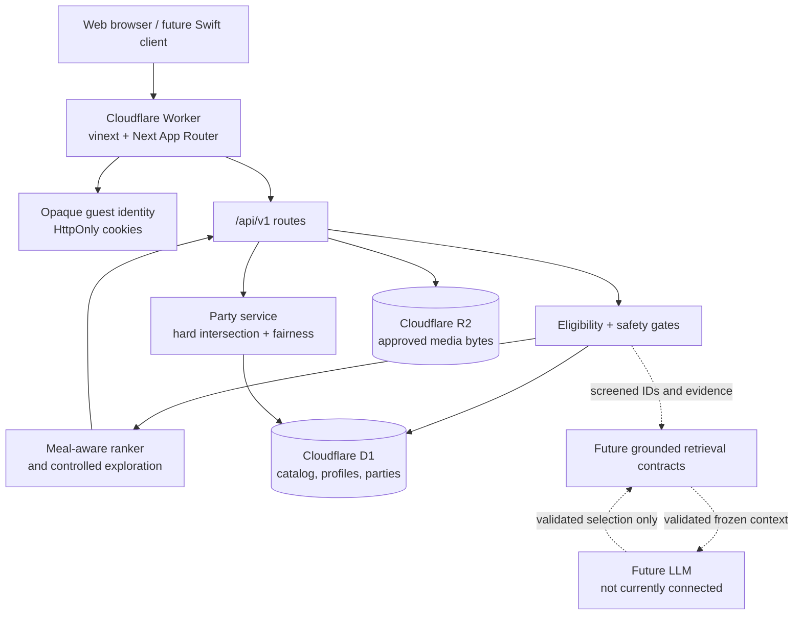

# Food Discovery MVP — detailed continuation handoff

> This document is written for the next engineer taking over the project.
> Read the “release snapshot” and “non-negotiable invariants” first. The code,
> migrations, and automated tests are the final authority if another document
> disagrees.

## 0. Release snapshot

The implementation described below was validated, migrated, and deployed on
July 26, 2026 PDT (July 27 UTC). The implementation commit and draft pull
request fields are filled after the first push because this file is part of
that commit.

| Item | Final value |
| --- | --- |
| Repository | `https://github.com/brianbzeng/food-discovery-mvp.git` |
| Release branch | `codex/core-model-foundation` |
| Final implementation commit SHA | `bae812081f4b5388c9d7e37dec44cdda1401becd` |
| Draft pull request | [food-discovery-mvp#1](https://github.com/brianbzeng/food-discovery-mvp/pull/1) |
| Final local validation | July 26 PDT: `npm test` (82/82), `npm run lint`, `npm run typecheck`, `git diff --check`, six-migration fresh-D1 Wrangler smoke, generated-config audit, and Wrangler deploy dry run all passed. Production-dependency audit: 0 vulnerabilities. Swift was not installed on the Windows host, so `swift:build` was not run. |
| Production D1 pre-change bookmark | `00000009-00000000-000050b5-43d5b896f7eb6df34acfbf3a9ed2ddef` |
| Production migrations applied | Ledger bootstrapped only after schema verification; `0000`–`0005` are recorded. `0004_nebulous_shard.sql` and `0005_unusual_apocalypse.sql` applied successfully. |
| Production Worker version/deployment ID | `90f8c890-ba06-4667-aaf0-52a288c811ec` |
| Production URL | `https://food.brianbzeng.com` |
| `workers.dev` URL | `https://food-discovery-mvp.bzeng9099.workers.dev` |
| Production smoke-test result | Passed July 26 PDT: home/About/Privacy/Terms/custom 404, custom and Worker URLs, read-only account export, private cache headers, default profile, malformed-setting fail-closed behavior, cross-origin/content-type rejection, spoofed-header rejection, dish-level safe sibling, concurrent save/permanent-hide preservation, two-member party create/invite/accept/recommend, account deletion, and remote cleanup. The final party smoke returned 2 accepted members and 3 recommendations; all four disposable profiles/interactions and all smoke parties/members were absent afterward. |
| Rollback reference | Previous Worker version `54f568c4-ce05-4f16-b5bf-15d15d76c88f`; pre-change D1 bookmark above. A post-release bookmark was `0000000a-00000028-000050b5-757943f7b1bc5cfce9aeb04f2fb396cb`. |

The first live party recommendation smoke exposed a missing `await` in the
default D1 loader. That version was superseded immediately; the final version
above includes the fix and passed both one-member and two-member party flows.

## 1. Executive summary

This is a Cloudflare-hosted, local-first food discovery MVP. It recommends
published dishes from independently owned restaurants and reviewed small local
groups. It combines:

- hard catalog eligibility;
- dish-level dietary and allergen screening;
- visible cross-contact and missing-evidence warnings;
- meal-aware taste learning from user interactions;
- deterministic controlled exploration;
- persistent anonymous profiles and saves in D1;
- a tested API foundation for “find something for everyone” party planning;
- strict, fail-closed contracts for a future grounded RAG assistant; and
- legal/information pages plus a custom 404.

The current UI is useful for guest testing. It asks what meal the person is
looking for with six choices: breakfast, brunch, lunch, dinner, late night, and
snack. It prompts the user to open the account/privacy drawer on the first save
or after roughly five card choices. That drawer currently explains private
guest mode because public sign-in is deliberately disabled.

The following are **not** finished products:

- There is no verified account login or cross-device profile.
- There is no live LLM, embedding pipeline, Vectorize index, or RAG chat.
- The current assistant endpoint is a deterministic intent parser and
  recommendation formatter, not generative AI.
- Party planning is API-first. There is no party UI or email/SMS invite
  delivery.
- Catalog records and restriction evidence are fictional pilot data.
- The legal copy is an MVP baseline, not counsel-reviewed legal advice.
- The Swift client exists as a foundation but does not yet expose all new
  profile, meal, party, and safety features.

## 2. Non-negotiable invariants

These decisions protect users and must survive future refactors.

1. **Never trust `oai-authenticated-user-email`, a forwarded email address, or
   any other caller-supplied identity header on the public Worker.**
   A browser can spoof ordinary request headers. Re-enable accounts only after
   the Worker cryptographically validates an identity token, such as a properly
   configured Cloudflare Access JWT or another verified auth provider token.

2. **Safety and eligibility run before ranking, retrieval, or an LLM.**
   Taste, popularity, exploration, party fairness, semantic similarity, and
   prompt instructions cannot restore a candidate removed by a hard gate.

3. **A conflicting menu item removes that dish, not automatically the entire
   restaurant.**
   Another dish at the restaurant may remain eligible. Venue-wide or
   shared-kitchen evidence is evaluated separately and may warn or exclude
   according to policy.

4. **Unknown evidence is never described as safe.**
   It is either excluded or returned with a persistent warning. Severe-allergy
   users must still confirm preparation and cross-contact directly with the
   restaurant.

5. **Interaction preference keys are derived server-side from an eligible D1
   catalog record.**
   Do not accept arbitrary client-provided preference keys for learning.

6. **“Never show” is an exact restaurant exclusion.**
   It must not globally penalize all cuisines or tags associated with that
   restaurant.

7. **Only accepted party members affect group recommendations.**
   Pending, declined, expired, and revoked invitations cannot influence
   scoring.

8. **Party responses must not reveal another member’s raw profile or
   member-specific recommendation outcome.**
   The public recommendation response contains group aggregates and only the
   caller’s own outcome.

9. **An LLM may select or summarize only pre-screened candidates and grounded
   claim IDs.**
   It may never query D1 directly, invent a candidate, relax constraints, or
   create uncited restaurant facts.

10. **Production D1 schema changes happen before deploying code that requires
    the new columns or tables.**
    Capture a Time Travel bookmark first and verify the migration ledger.

## 3. Product and implementation status

### Implemented in the web MVP

- Responsive discovery interface with card actions and detail drawer.
- Meal intent selector for breakfast, brunch, lunch, dinner, late night, and
  snack.
- Natural-language craving parsing into visible structured chips.
- Eligible D1 catalog feed and structured search.
- Independent/local ownership gate before ranking.
- Radius and `openNow` hard filters.
- D1-backed guest taste profile, interactions, shortlist, and data controls.
- Explicit preference weights plus learned global and meal-specific weights.
- Negative-signal decay and exact permanent restaurant hiding.
- Seeded controlled exploration.
- Dish-level allergen and dietary evidence.
- Separate `dish`, `shared_kitchen`, and `venue` evidence scopes.
- User-controlled unknown-evidence visibility and strict whole-place allergy
  screening.
- Account data summary, JSON export, and deletion for profile/interactions/saves.
- Restaurant details, hours, calls, menu links, and directions handoffs.
- Rights-gated R2 media store and serving endpoint.
- Catalog intake/review data model and OpenStreetMap preview tooling.
- About, Privacy, Terms, and a custom 404 page.
- Synthetic recommendation evaluation and isolated Miniflare D1 migration tests.

### Implemented as an API/domain foundation, without UI

- Party creation and membership persistence.
- Creator-only invite creation and revocation.
- Hashed, expiring, single-use invitation tokens.
- Accept/decline lifecycle.
- Per-member hard safety intersection.
- Separate-dish and shared-dish modes.
- Least-misery and minimum/average fairness strategies.
- Privacy-minimized group recommendation responses.

### Implemented as contracts and tests only

- Grounded assistant retrieval request/result contracts.
- Separate screened restaurant and dish allowlists.
- Evidence citation validation.
- Frozen model context.
- Post-model candidate and claim revalidation.
- Minimized party preference aggregates for a future assistant.

### Not implemented

- Verified user authentication.
- Guest-to-account migration in a live public flow.
- Party screens, join screen, invitation delivery, voting, scheduling, chat,
  notifications, or member management after acceptance.
- Live LLM calls.
- Embeddings, Vectorize, semantic indexing, or retrieval orchestration.
- Production restaurant/evidence ingestion at meaningful scale.
- Public catalog moderation UI.
- Payments, orders, reviews, promotions, or public uploads.
- Formal accessibility audit.
- Counsel review of Terms or Privacy.
- Automated CI under `.github/workflows`.
- A separately configured staging environment.

## 4. Architecture



### Runtime stack

- TypeScript 5.9
- React 19
- Next 16 App Router source
- Vinext/Vite compilation for Cloudflare Workers
- Cloudflare Workers runtime with `nodejs_compat`
- Drizzle schema definitions and generated SQL migrations
- Cloudflare D1 for relational/state data
- Cloudflare R2 for approved media
- Node’s built-in test runner
- Miniflare for isolated D1 integration tests

### Request path

1. The Worker receives the request.
2. Product endpoints resolve or create a validated opaque guest/session cookie.
3. Feed/search loads the current D1 taste profile.
4. D1 catalog queries admit only eligible ownership states and published dishes.
5. Hard location/opening/safety/hidden-restaurant filters run.
6. The remaining dish candidates are scored.
7. Controlled exploration may alter a bounded part of the ordering using the
   current session ID as a deterministic seed.
8. The response returns score components, reasons, warnings, and evidence IDs.

### Key repository map

| Path | Responsibility |
| --- | --- |
| `app/discovery-demo.tsx` | Main browser UI, meal selector, drawers, card actions |
| `app/api/v1/` | Web/future-client HTTP API |
| `app/lib/recommendations.ts` | Solo hard screening and scoring |
| `app/lib/taste-learning.ts` | Interaction weights, meal segments, decay |
| `app/lib/taste-identity.ts` | Guest/session cookie identity |
| `app/lib/feed-service.ts` | Intent normalization and feed orchestration |
| `app/lib/intent-parser.ts` | Deterministic craving interpretation |
| `app/lib/party-recommendations.ts` | Pure party safety/fairness algorithm |
| `app/lib/party-recommendation-service.ts` | Server-side profile/catalog party orchestration |
| `app/lib/assistant-retrieval-contracts.ts` | Future RAG trust boundary |
| `db/schema.ts` | Durable D1 schema |
| `db/catalog-store.ts` | Eligible catalog query and evidence attachment |
| `db/taste-store.ts` | Taste profile and interaction persistence |
| `db/account-store.ts` | Profile/saves/interactions merge/export/delete |
| `db/party-store.ts` | Party lifecycle and authorization |
| `db/party-catalog-store.ts` | Restaurant-first party catalog load |
| `drizzle/` | Ordered SQL migrations |
| `tests/` | Unit, synthetic, render, and Miniflare integration coverage |
| `docs/rag-architecture.md` | Detailed future assistant trust model |
| `docs/party-planning.md` | Party lifecycle and privacy boundary |
| `wrangler.jsonc` | Source Cloudflare resource configuration |
| `.openai/hosting.json` | Logical binding names used by the build integration |
| `dist/server/wrangler.json` | Generated deploy configuration after build |

## 5. Identity and authentication security decision

### Current identity

All public requests are guest requests:

- `food_guest_id`: UUID-shaped opaque ID, up to one year.
- `food_session_id`: UUID-shaped opaque ID, up to four hours.
- Both cookies use `HttpOnly`, `SameSite=Lax`, `Path=/`, and `Secure` on HTTPS.
- Malformed or non-UUID cookie values are rejected and rotated.
- The D1 principal is `guest:<uuid>`.

The session ID seeds exploration and groups interaction context. The guest ID
owns profile, saves, party membership, and other durable product state.

### Why public account sign-in is disabled

The earlier prototype treated a forwarded email header as authenticated
identity. On a directly public Worker, an attacker can supply that same header.
That would allow profile and account impersonation.

The fix is intentionally conservative:

- `resolveProductIdentity()` always delegates to guest identity.
- `getChatGPTUser()` always returns `null`.
- The UI says account sign-in is temporarily disabled.
- Incoming “authenticated email” headers are ignored.

Do not reverse this by checking whether a header exists. A correct account
implementation must:

1. establish a trusted upstream or auth provider;
2. validate token signature, issuer, audience, expiry, and nonce/session
   properties at the Worker;
3. strip or ignore any untrusted identity headers;
4. derive an internal non-email principal;
5. test spoofed, expired, wrong-audience, and replayed tokens;
6. design guest-to-user merge conflict rules, including party ownership and
   membership;
7. update Privacy and Terms; and
8. provide recovery, sign-out, and cross-device behavior.

### Security implications of guest-only mode

- The profile is browser/cookie-bound, not a durable human account.
- Clearing cookies disconnects the person from D1 data; it does not itself
  delete the old record.
- Anyone who steals the cookie can act as that guest.
- There is no account recovery.
- Party membership does not transfer across browsers.
- Export and deletion operate on the current cookie principal only.

## 6. Catalog eligibility and safety model

### Hard catalog eligibility

`db/catalog-store.ts` admits a candidate only when:

- `restaurants.discovery_status = 'eligible'`;
- `ownership_type` is `independent` or `local_group`;
- the dish is published;
- any exact restaurant/dish request matches;
- structured query filters match;
- `openNow`, when requested, passes local-time opening-hours evaluation; and
- distance, when coordinates are present, is inside the requested radius.

Franchises, regional chains, national chains, unreviewed records, and
unpublished dishes are absent before scoring.

### Evidence shape

Each `restriction_evidence` record has:

- `restriction_key`, such as `peanut` or `vegan`;
- `status`: `contains`, `compatible`, `accommodates`, or `unknown`;
- `evidence_scope`: `dish`, `shared_kitchen`, or `venue`;
- source type, URL, merchant-confirmation flag, verification time, and notes;
- optional `dish_card_id`.

The catalog store attaches only:

- restaurant-level evidence with no dish ID; and
- evidence for the exact candidate dish.

Evidence for a conflicting sibling dish is therefore not attached to a safe
candidate.

### Solo safety behavior

For every saved or request-scoped allergen/dietary key:

| Evidence/policy | Result |
| --- | --- |
| Current dish or venue evidence says `contains` | Exclude that candidate |
| Another dish says `contains` | Does not affect this candidate |
| Shared-kitchen allergen risk + `strict` | Exclude venue candidate |
| Shared-kitchen allergen risk + `dish-aware` | Keep candidate with `cross-contact` warning |
| Compatible/accommodates evidence exists | Candidate may continue |
| No compatible evidence + unknown display disabled | Exclude |
| No compatible evidence + strict allergen mode | Exclude |
| No compatible evidence + warnings allowed | Keep with persistent unknown warning |

The default new profile has:

- no invented allergens;
- no dietary restrictions;
- `showUnknownAllergyMatches = true`; and
- `allergenStrictness = "dish-aware"`.

“Dish-aware” is not a guarantee of safety. It means a compatible dish can
remain visible while shared-kitchen uncertainty is shown. “Strict” is the
whole-place screening option for users who do not accept that uncertainty.

### Concrete pilot example

Migration `0004_nebulous_shard.sql` gives fictional Fold House two dishes:

- `demo-fold-house`: contains peanut at dish scope.
- `demo-fold-house-vegetable-wontons`: compatible with peanut at dish scope.

Fold House also has a restaurant-level shared-kitchen peanut warning. Therefore:

- the peanut-containing dumpling is removed;
- the vegetable wontons remain eligible in dish-aware mode with a
  cross-contact warning; and
- strict mode excludes the restaurant candidate.

This is the main regression example for the requirement “an allergy on one
menu item must not hide an otherwise suitable restaurant.”

### Unknown-evidence boundary

Solo and party recommendations both keep unknown dietary evidence fail-closed.
`showUnknownAllergyMatches` applies only to allergen uncertainty. In
dish-aware mode, shared-kitchen and unknown venue-wide allergen evidence stay
visible with warnings; strict mode excludes them. Confirmed venue-wide
allergen conflicts always exclude the restaurant.

## 7. Recommendation model

### Score

Eligible candidates receive a 0–100 score:

```text
score =
  context      * 0.30 +
  taste        * 0.30 +
  distance     * 0.15 +
  price        * 0.10 +
  data quality * 0.10 +
  novelty      * 0.05
```

The API exposes each component as an integer percentage.

### Context

- A text query is matched against restaurant name, dish title/description,
  neighborhood, venue type, cuisine tags, and dish tags.
- With no text query, context starts at a neutral value.
- Meal occasion adds affinity for contextual terms such as morning/coffee for
  breakfast, quick/bowl/noodles for lunch, shareable/pizza for dinner, and
  snack/dessert/boba for snack.

### Taste

Candidate keys are server-derived:

- `venue:<venue type>`
- `locality:<ownership type>`
- `neighborhood:<neighborhood>`
- `cuisine:<tag>`
- `tag:<dish tag>`

Taste combines:

- explicit user preference weights;
- long-term learned weights; and
- the active meal occasion’s learned weights.

Weights are normalized and clamped from `-12` to `+12`.

### Distance

- Coordinates plus radius are a hard boundary.
- Minimum accepted radius is 500 meters.
- Default radius is 8,000 meters when coordinates are supplied without one.
- API normalization caps radius at 40,000 meters.
- Without coordinates, distance uses a neutral score.

### Data quality

Quality increases for:

- source references;
- restriction evidence;
- contact/menu/website data; and
- recent verification.

Missing or stale verification and unverified service modes create warnings.

### Novelty and controlled exploration

- Novelty is higher for unfamiliar candidate keys.
- Feed/search/assistant requests use the session ID as `explorationSeed`.
- The default exploration rate is 15%.
- The output is deterministic for the same seed and candidate set.
- Normal exploration protects the highest-ranked positions and injects a
  bounded number of candidates farther down.
- Tests can set `explorationRate = 1` to measure seed diversity.

Do not use `Math.random()` in production ranking. Reproducibility matters for
debugging, evaluation, and explaining a recommendation.

## 8. Taste learning and meal context

### Interaction weights

| Event | Global/occasion delta |
| --- | ---: |
| External handoff | `+5` |
| Save | `+4` |
| Like / more like this | `+3` |
| Detail open | `+1` |
| View | `0` |
| Pass / not now | `-1` |
| Unsave | `-4` |
| Never show | `0` on tags; exact restaurant is hidden |

A targeted pass reason can apply `-3` to the relevant key:

- `too-spicy`
- `too-sweet`
- `not-this-cuisine`
- `not-this-venue`
- `avoid:<namespaced-key>`

### Meal segmentation

The supported occasions are:

- `breakfast`
- `brunch`
- `lunch`
- `dinner`
- `late-night`
- `snack`

When an interaction has an occasion, it updates both:

- the long-term/global learned weights; and
- the weight map for that occasion.

This means a dinner like has general influence and additional influence during
dinner. The UI sends the selected occasion with interactions.

### Negative decay

- Positive weights remain stable.
- Negative weights decay with a 45-day half-life.
- Near-zero decayed values are removed.
- Decay currently uses the profile’s shared `updated_at`, not a separate
  timestamp per key or event. If precise temporal learning becomes important,
  store per-signal timestamps or compute from interaction history.

### Permanent hiding

`never_show` appends the exact restaurant ID to
`taste_profiles.hidden_restaurant_ids`. Solo and party recommendation services
filter those IDs. In party mode, a restaurant hidden by any accepted member is
removed for the group.

### Server-derived interaction features

`POST /api/v1/interactions` requires an eligible restaurant and dish. The
server reloads that exact D1 candidate and derives preference keys from the
catalog. Client-supplied tags cannot poison the learned model.

## 9. Synthetic evaluation and D1 integration coverage

### Synthetic evaluator

`app/lib/recommendation-evaluation.ts` creates deterministic profiles and
catalog fixtures. `tests/recommendation-evaluation.test.mjs` treats all six
checks as passing baselines:

1. Dish-level allergen safety:
   - no unsafe-dish leak;
   - compatible sibling retained;
   - warning-mode unknown retained and warned;
   - strict unknown excluded.
2. Deterministic cold-start order.
3. Positive taste learning increases both rank and score.
4. Breakfast and late-night occasion segmentation.
5. Permanent hidden-restaurant exclusion.
6. Controlled exploration is deterministic for a seed and varies across seeds.

The latest observed metrics before the final release run were:

- unsafe leaks: `0`;
- safe sibling retained: `true`;
- learned target rank: `2 → 1`;
- learned target score: `64 → 67`;
- breakfast and late-night leaders matched their expected fixtures;
- hidden-restaurant leaks: `0`; and
- deterministic exploration covered all five tied top candidates across the
  test seeds.

Re-run the tests and update this paragraph if those values change.

### Miniflare D1 integration

`tests/d1-model-integration.test.mjs`:

- creates an isolated D1 instance;
- applies ordered SQL migrations;
- verifies new profile/evidence columns;
- verifies cleanup of the old invented peanut default;
- checks the 14-dish/7-restaurant pilot catalog;
- checks dish-level compatible siblings and shared-kitchen warnings;
- records interaction/occasion learning and exact hiding.

The integration test applies `0005_unusual_apocalypse.sql` and asserts both
`parties` and `party_members`, including the invitation lifecycle columns. It
passed in the final 60-test run.

### Other important suites

- `tests/taste-learning.test.mjs`
- `tests/catalog-feed.test.mjs`
- `tests/catalog-operations.test.mjs`
- `tests/identity.test.mjs`
- `tests/intent-parser.test.mjs`
- `tests/rendered-html.test.mjs`
- `tests/common-pages.test.mjs`
- `tests/party-recommendations.test.mjs`
- `tests/party-store.test.mjs`
- `tests/assistant-retrieval-contracts.test.mjs`

## 10. Current UI behavior

### Entry and meal selection

The first discovery panel visibly asks “HUNGRY FOR” and offers all six meal
occasions. Selecting one:

- changes the active structured intent;
- refreshes the D1 feed;
- affects context scoring;
- sends meal context with future interactions; and
- uses the corresponding occasion-weight map.

It is an inline first-screen choice, not a blocking modal. That lets a person
scroll and browse without answering.

### Account/profile prompting

The UI opens the account/privacy drawer:

- on the first newly saved restaurant; or
- after approximately the fifth pass/like choice.

The original product idea was to prompt account creation. Because verified
authentication is not ready, the drawer currently:

- explains browser-bound private guest mode;
- shows save and taste-signal counts;
- offers JSON export;
- offers data deletion; and
- explains why sign-in is disabled.

Do not change the copy to promise account creation until verified auth exists.

### Food profile

The safety drawer supports:

- common allergens;
- dietary restrictions;
- show/hide unknown evidence; and
- strict whole-place allergy screening.

Saving writes to D1 and increments profile version.

### Common pages

- `/about`
- `/privacy`
- `/terms`
- custom app-level 404

All pages share the project/legal footer. The copy explicitly says it is an MVP
legal baseline. There is no Contact page because no verified public contact
channel was provided. There is no Accessibility statement because a formal
audit and feedback process do not yet exist.

## 11. Party planning foundation

### Product promise

The party service is designed around “find something for everyone.” It treats
every accepted member’s restrictions as hard gates, then balances soft taste
preferences fairly.

### Lifecycle

1. A guest principal creates a party and becomes its accepted creator member.
2. Only `parties.creator_principal_id` can create or revoke invitations.
3. An invitation generates 32 random bytes, represented as an opaque token.
4. Only the token’s SHA-256 hash is stored in D1.
5. The plaintext token is returned once for manual sharing.
6. The token expires after seven days.
7. Accepting or declining clears the stored token hash, preventing replay.
8. Revoking an invitation also clears the hash.
9. Only the creator or accepted members may view a party.
10. Only accepted members may request recommendations.

There can be at most 25 active `invited` or `accepted` members.

### Authorization and privacy

- Creator authority comes from the party row, not a client-provided role.
- Non-creators see accepted members only; creators can see pending/declined/
  revoked member states.
- Public member objects include display name, role, status, and timestamps but
  no principal ID or token hash.
- Recommendation data is loaded server-side.
- The endpoint rejects client-supplied profiles, principals, allergens, and
  policies.
- Responses use `Cache-Control: private, no-store` and `Vary: Cookie`.
- Party mutations enforce same-origin browser requests.
- Party JSON bodies are limited to 16 KB.

### Safety and fairness

For every accepted member:

- their current D1 profile is loaded;
- each dish is evaluated against their allergens and dietary restrictions;
- a `contains` record vetoes that dish;
- unknown dietary evidence is fail-closed;
- unknown allergen evidence follows that member’s warning/exclude setting;
- cross-contact follows dish-aware warning versus strict exclusion; and
- their hidden restaurants are excluded.

By default, people may choose different safe dishes at the same restaurant.
`requireSharedDish = true` requires one dish that works for every accepted
member.

Fairness strategies:

- `least-misery`: rank by the least-satisfied member, then group average.
- `min-average`: score `(least-satisfied + average) / 2`.

The public response includes:

- restaurant and selected dish IDs;
- overall and aggregate fairness measures;
- aggregate preference-match counts;
- a generic safety summary; and
- only the caller’s selected dish/satisfaction/confirmation requirement.

It excludes:

- other principals;
- other members’ allergens/dietary restrictions;
- raw preference keys;
- raw member outcomes;
- member-specific warnings; and
- least-satisfied member IDs.

### Restaurant-first catalog loading

`db/party-catalog-store.ts` first selects up to 24 eligible restaurants, then
loads **all** published dishes for those restaurants. Do not replace this with
a limited restaurant/dish join; doing so can omit the one compatible sibling
dish and incorrectly remove a venue from group consideration.

### Party endpoints

| Method | Path | Purpose |
| --- | --- | --- |
| `GET` | `/api/v1/parties` | List visible parties |
| `POST` | `/api/v1/parties` | Create party |
| `GET` | `/api/v1/parties/{partyId}` | Read authorized party view |
| `POST` | `/api/v1/parties/{partyId}/invitations` | Creator creates invite |
| `DELETE` | `/api/v1/parties/{partyId}/invitations/{memberId}` | Creator revokes pending invite |
| `POST` | `/api/v1/party-invitations/respond` | Accept or decline by token |
| `GET` | `/api/v1/parties/{partyId}/recommendations?limit=10` | Group recommendations |

Create-party body:

```json
{
  "name": "Friday dinner",
  "displayName": "Brian",
  "requireSharedDish": false,
  "fairnessStrategy": "least-misery"
}
```

Create-invitation body:

```json
{
  "displayName": "Friend"
}
```

Invitation response body:

```json
{
  "inviteToken": "<one-time-token>",
  "response": "accepted"
}
```

### Party limitations that must remain visible

- No party or join UI.
- No email/SMS/push delivery.
- Future join links should keep the token in a URL fragment, not a query
  string, so it is not automatically sent in access logs/referrers.
- No resend; create a new invitation after expiry/revocation.
- No accepted-member removal, creator transfer, archive endpoint, voting,
  scheduling, chat, or notifications.
- Guest-only identity prevents cross-device continuity.
- `db/account-store.ts` now exports the current principal's owned-party and
  membership records without token hashes. Deletion removes owned parties and
  the principal's other memberships. A production smoke verified both export
  and cleanup.
- Privacy describes party display names, membership, invitation hash/expiry,
  recommendation privacy, and account-control behavior.
- Guest-to-account party ownership/membership merging is intentionally still
  dormant until verified account authentication exists.

## 12. Grounded RAG/assistant contracts

### What exists

`app/lib/assistant-retrieval-contracts.ts` provides exact-key parsers and
validators for:

- screened retrieval requests;
- solo and aggregate-party preference summaries;
- locked policy envelopes;
- separate eligible restaurant and dish ID allowlists;
- retrieval candidates;
- grounded claims;
- evidence citations;
- frozen model context; and
- post-model structured selection.

The contracts reject:

- missing eligibility/safety gates;
- relaxed hard constraints;
- unknown/private fields;
- raw party members;
- candidate IDs outside allowlists;
- uncited claims;
- missing, unused, or subject-mismatched citations; and
- model selections outside the validated context.

### What does not exist

There is no:

- LLM provider;
- Workers AI or OpenAI call;
- embedding model;
- Vectorize binding/index;
- semantic ingestion pipeline;
- prompt template;
- model tool call;
- production retrieval service; or
- RAG route wired into `/api/v1/assistant/messages`.

The current assistant endpoint parses text deterministically and calls the
normal D1 recommendation feed. Never describe it as a live AI assistant.

### Required future order

1. Load trusted profile and session/party context server-side.
2. Apply ownership, publication, opening-hours, radius, hidden-place, and hard
   safety gates.
3. Produce immutable restaurant and dish allowlists.
4. Rank structured candidates.
5. Run semantic retrieval only inside the allowlists.
6. Resolve evidence and construct subject-scoped claims.
7. Validate and freeze the context.
8. Ask the model for structured candidate/claim selection.
9. Revalidate the selection.
10. Render prose and persistent safety warnings server-side.

If any validation step fails, return no assistant recommendation. Do not fall
back to an unconstrained model answer.

## 13. HTTP API map

All identity-aware responses may set the guest/session cookies.

| Method | Path | Notes |
| --- | --- | --- |
| `GET` | `/api/v1/feed` | Query-string feed; session-seeded exploration |
| `POST` | `/api/v1/search` | Structured intent JSON |
| `POST` | `/api/v1/assistant/messages` | Deterministic parser, not LLM |
| `GET` | `/api/v1/taste-profile` | Get/create current guest profile |
| `PUT` | `/api/v1/taste-profile` | Partial safety/explicit preference update |
| `POST` | `/api/v1/interactions` | Validates exact eligible D1 dish |
| `GET` | `/api/v1/saves` | Current guest shortlist |
| `PUT` | `/api/v1/saves/{restaurantId}` | Idempotent eligible save |
| `DELETE` | `/api/v1/saves/{restaurantId}` | Remove save |
| `GET` | `/api/v1/restaurants/{restaurantId}` | Eligible place details |
| `GET` | `/api/v1/media/{dishCardId}` | Approved, unexpired R2 media |
| `GET` | `/api/v1/account` | Guest/account-state counts |
| `GET` | `/api/v1/account/export` | Private JSON download |
| `DELETE` | `/api/v1/account` | Delete current principal’s implemented data |
| `GET/POST` | `/api/v1/parties` | Party list/create |
| `GET` | `/api/v1/parties/{partyId}` | Authorized party view |
| `POST` | `/api/v1/parties/{partyId}/invitations` | Create one-time invite |
| `DELETE` | `/api/v1/parties/{partyId}/invitations/{memberId}` | Revoke pending invite |
| `POST` | `/api/v1/party-invitations/respond` | Accept/decline invite |
| `GET` | `/api/v1/parties/{partyId}/recommendations` | Private group feed |

### Feed query parameters

- `q`
- `latitude`
- `longitude`
- `radiusMeters`
- repeated `venueType`
- repeated `priceTier`
- repeated `allergen`
- repeated `dietaryRestriction`
- `occasion`
- `serviceMode`
- `openNow=true`
- `limit` from 1 to 50

Request-scoped restrictions add to saved profile restrictions; they do not
remove saved constraints.

### Interaction request

```json
{
  "restaurantId": "restaurant-fold-house",
  "dishCardId": "demo-fold-house-vegetable-wontons",
  "eventType": "like",
  "reasonCode": null,
  "occasion": "dinner",
  "context": {
    "surface": "discovery"
  }
}
```

Valid event types are `view`, `pass`, `like`, `save`, `unsave`, `detail`,
`share`, `handoff`, and `never_show`.

### Taste-profile update

All fields are optional. Including an empty list intentionally clears that
setting.

```json
{
  "allergens": ["peanut"],
  "dietaryRestrictions": ["vegetarian"],
  "showUnknownAllergyMatches": true,
  "allergenStrictness": "dish-aware",
  "explicitPreferences": {
    "cuisine:vietnamese": 5,
    "tag:very-sweet": -4
  }
}
```

Unsupported allergen/dietary keys are discarded. Explicit keys must be
namespaced, normalized, finite, and bounded.

## 14. D1 schema

The application schema has 12 domain tables:

| Table | Purpose |
| --- | --- |
| `restaurants` | Place identity, ownership, eligibility, address, tags, links |
| `dish_cards` | Published recommendation/menu items |
| `restriction_evidence` | Dish/shared-kitchen/venue evidence |
| `restaurant_hours` | Weekly hours and source freshness |
| `media_assets` | R2 object metadata and rights status |
| `taste_profiles` | Explicit/global/occasion taste and safety settings |
| `interaction_events` | Immutable-ish behavioral event log |
| `saved_restaurants` | Principal shortlist |
| `catalog_imports` | Quarantined provider candidates |
| `catalog_review_events` | Human ownership/publication decisions |
| `parties` | Party creator/configuration/status |
| `party_members` | Membership and hashed invitation state |

Wrangler also uses `d1_migrations`. Cloudflare may expose its own internal
tables; do not treat those as application schema.

### Migration history

| Migration | Change |
| --- | --- |
| `0000_dry_scarlet_spider.sql` | Base restaurants, dishes, media, restriction evidence, taste profiles, interactions |
| `0001_dear_junta.sql` | Venue/ownership/discovery policy and seven fictional restaurants/dishes |
| `0002_amusing_kat_farrell.sql` | Catalog intake/review and initial fictional restriction evidence |
| `0003_powerful_doctor_octopus.sql` | Hours, saves, address/contact/handoff data |
| `0004_nebulous_shard.sql` | Evidence scope, occasion weights, allergen strictness, second dish per restaurant, expanded evidence |
| `0005_unusual_apocalypse.sql` | Parties and party members |

### Important `0004` cleanup

The old prototype silently created profiles with `["peanut"]`. Migration
`0004` clears allergens only for the exact legacy signature:

```sql
allergens = '["peanut"]'
AND explicit_preferences = '{}'
AND dietary_restrictions = '[]'
```

This was appropriate for the pilot database observed during this release. Do
not copy that cleanup into a later migration or rerun it manually after real
users may have intentionally saved a peanut allergy. The predicate has no
seeded-default marker, so on non-pilot data it can erase a legitimate
peanut-only profile. Production was inspected before applying it and the
pre-change Time Travel bookmark
`00000009-00000000-000050b5-43d5b896f7eb6df34acfbf3a9ed2ddef` must be
retained as the rollback reference.

### Expected pilot catalog after `0004`

- 7 eligible fictional restaurants.
- 14 published fictional dishes.
- 29 restriction-evidence records.
- Shared-kitchen peanut evidence at every pilot restaurant.
- Two published Fold House dishes demonstrating safe sibling behavior.

Use SQL verification rather than assuming counts in a different environment.

## 15. Cloudflare resources and configuration

### Account and resources

| Resource | Value |
| --- | --- |
| Cloudflare account ID | `f8dd8297df368ee2d0ad296d9289bfec` |
| Worker | `food-discovery-mvp` |
| Custom domain | `food.brianbzeng.com` |
| D1 database | `site-creator-d1` |
| D1 database ID | `3175b90d-fbbc-49d2-bf2d-698951c146eb` |
| Worker D1 binding | `DB` |
| R2 bucket | `site-creator-r2` |
| Worker R2 binding | `MEDIA` |
| Compatibility date | `2026-07-23` |
| Observability | enabled |

The account ID and database ID identify resources but are not API credentials.
Never commit Cloudflare API tokens, OAuth tokens, or party invite tokens.

### Configuration roles

`wrangler.jsonc` is the source configuration for:

- Worker name;
- built server entry and asset directory;
- compatibility settings;
- D1/R2 bindings;
- `drizzle` migration directory; and
- observability.

`.openai/hosting.json` contains logical binding names:

```json
{
  "project_id": "appgprj_6a66bf7446808191919318330ca83989",
  "d1": "DB",
  "r2": "MEDIA"
}
```

That project ID belongs to the earlier public Sites preview at
`https://near-and-dear-discovery-bz.brianzeng144308.chatgpt.site` (saved
version 2). It was recorded so future tools do not create a duplicate project.
It was **not** redeployed in this release: the owner explicitly moved active
collaboration to Cloudflare, and the canonical production URL is
`https://food.brianbzeng.com`. Updating the public Sites preview later requires
an explicit decision because it is a separate public deployment.

The build emits `dist/server/wrangler.json`. Use the root config for D1
migration commands because its `migrations_dir` is unambiguous.

**Release preflight history:** a generated config was initially observed with
duplicate `DB`, `MEDIA`, and `nodejs_compat` entries and both
`../../migrations` and `../../drizzle`. It came from combining root Wrangler
configuration with Vite’s inline binding configuration. The configuration was
then corrected, and the next generated artifact showed one `DB`, one `MEDIA`,
one `nodejs_compat`, and `../../drizzle`.

The final clean build and dry run confirmed exactly one `DB`, one `MEDIA`, one
`nodejs_compat`, and `../../drizzle`. Use root `wrangler.jsonc` for D1
migrations and generated `dist/server/wrangler.json` for Worker deployment.

### Domain ownership

The custom domain is not declared in the current `wrangler.jsonc`; it is
managed in Cloudflare’s Worker Domains/Routes UI. Confirm
`food.brianbzeng.com` points directly to `food-discovery-mvp`.

The earlier `near-and-dear-food-gateway` experiment is not required for the
application architecture. Do not delete or reattach any Worker solely from
this document; inspect the Cloudflare account and confirm ownership/traffic
first.

## 16. Local setup

### Prerequisites

- Node.js `>=22.13.0`
- npm
- Git
- Wrangler authentication for remote operations only
- Optional: Swift toolchain/macOS for the Swift package/app

On this Windows machine, PowerShell execution policy blocks `npx.ps1`. Use
`npx.cmd` and `npm.cmd`. On macOS/Linux, use ordinary `npx` and `npm`.

### Clone and install

```powershell
git clone https://github.com/brianbzeng/food-discovery-mvp.git
Set-Location food-discovery-mvp
git switch codex/core-model-foundation
npm.cmd ci
```

Never copy `.wrangler`, `.env*`, cookie jars, or exported production data into
Git.

### Local D1 initialization

The application requires D1 tables. Use local migrations, never `--remote`,
for local setup:

```powershell
npx.cmd wrangler d1 migrations list site-creator-d1 --local --config wrangler.jsonc
npx.cmd wrangler d1 migrations apply site-creator-d1 --local --config wrangler.jsonc
```

Then:

```powershell
npm.cmd run dev
```

Open `http://localhost:3000`.

If the Vite plugin and Wrangler CLI appear to use different local persistence
directories, do not point development at production D1 as a shortcut. Inspect
`.wrangler` state/registry configuration and make their local persistence
explicit.

### Validation

```powershell
npm.cmd run typecheck
npm.cmd run lint
npm.cmd test
git diff --check
npm.cmd audit --omit=dev
npm.cmd audit
```

Notes:

- `npm test` runs a production build before the Node tests.
- `npm audit --omit=dev` was clean when this handoff was drafted.
- The full audit reported nine high-severity advisories in the ESLint/
  minimatch/brace-expansion development toolchain.
- Do not run a blind breaking `npm audit fix --force`. Upgrade the lint stack
  deliberately, verify Next compatibility, and rerun all checks.
- `npm run swift:build` is optional on a machine with Swift. The web release
  should not claim Swift validation if the toolchain was unavailable.

### Useful targeted tests

```powershell
node --test tests/recommendation-evaluation.test.mjs
node --test tests/d1-model-integration.test.mjs
node --test tests/party-recommendations.test.mjs
node --test tests/party-store.test.mjs
node --test tests/assistant-retrieval-contracts.test.mjs
```

Rendered-page tests require a fresh build first.

## 17. Production migration and deploy runbook

Production changes should be performed from a clean, reviewed, pushed commit.
Never deploy an untracked local state that the next engineer cannot recover.

### Phase A — preflight

```powershell
git status --short
git log -1 --oneline
node --version
npm.cmd --version
npx.cmd wrangler --version
npx.cmd wrangler whoami
```

Expected Wrangler major version: 4.

Run all validation commands in section 16. Confirm the diff contains no
credentials, exports, invite tokens, or unrelated user work.

### Phase B — capture rollback references

Capture a D1 Time Travel bookmark before any production write:

```powershell
npx.cmd wrangler d1 time-travel info site-creator-d1 --config wrangler.jsonc --json
```

Record the bookmark in the release snapshot and a private operator log.

List the previous Worker versions:

```powershell
npx.cmd wrangler versions list --name food-discovery-mvp --json
```

Record the currently deployed version.

### Phase C — verify the migration ledger

```powershell
npx.cmd wrangler d1 execute site-creator-d1 --remote --config wrangler.jsonc --command "SELECT name FROM sqlite_master WHERE type='table' AND name='d1_migrations';"
npx.cmd wrangler d1 execute site-creator-d1 --remote --config wrangler.jsonc --command "SELECT id, name, applied_at FROM d1_migrations ORDER BY id;"
npx.cmd wrangler d1 migrations list site-creator-d1 --remote --config wrangler.jsonc
```

#### One-time historical ledger issue

Before this release, remote D1 had the effects of migrations `0000`–`0003` but
did not have a `d1_migrations` table. If the root release task has already
bootstrapped it, do nothing.

If it is still missing:

1. Stop.
2. Compare the actual schema/data to migrations `0000`–`0003`.
3. Confirm `0004` columns and `0005` tables are absent.
4. Keep the Time Travel bookmark.
5. Only then create the ledger and record the four already-applied migrations.

The intended ledger schema is:

```sql
CREATE TABLE IF NOT EXISTS d1_migrations (
  id INTEGER PRIMARY KEY AUTOINCREMENT,
  name TEXT UNIQUE,
  applied_at TIMESTAMP DEFAULT CURRENT_TIMESTAMP NOT NULL
);
```

The historical applied names are:

```text
0000_dry_scarlet_spider.sql
0001_dear_junta.sql
0002_amusing_kat_farrell.sql
0003_powerful_doctor_octopus.sql
```

Do not mark a migration applied merely to silence Wrangler. The schema must
actually match.

### Phase D — apply production migrations

After `migrations list` shows only the expected pending migrations:

```powershell
npx.cmd wrangler d1 migrations apply site-creator-d1 --remote --config wrangler.jsonc
```

Verify:

```powershell
npx.cmd wrangler d1 migrations list site-creator-d1 --remote --config wrangler.jsonc
npx.cmd wrangler d1 execute site-creator-d1 --remote --config wrangler.jsonc --command "PRAGMA table_info(taste_profiles);"
npx.cmd wrangler d1 execute site-creator-d1 --remote --config wrangler.jsonc --command "PRAGMA table_info(restriction_evidence);"
npx.cmd wrangler d1 execute site-creator-d1 --remote --config wrangler.jsonc --command "SELECT name FROM sqlite_master WHERE type='table' AND name IN ('parties','party_members','d1_migrations') ORDER BY name;"
npx.cmd wrangler d1 execute site-creator-d1 --remote --config wrangler.jsonc --command "SELECT COUNT(*) AS restaurants FROM restaurants; SELECT COUNT(*) AS dishes FROM dish_cards WHERE is_published = 1; SELECT COUNT(*) AS evidence FROM restriction_evidence;"
```

Expected pilot counts after `0004` are 7 restaurants, 14 published dishes,
and 29 restriction-evidence records. Investigate rather than forcing counts if
production has intentionally changed.

### Phase E — build and inspect deployment artifact

```powershell
npm.cmd run build
Get-Content -Raw dist/server/wrangler.json
```

Confirm:

- Worker name is `food-discovery-mvp`;
- one `DB` binding points to `site-creator-d1`;
- one `MEDIA` binding points to `site-creator-r2`;
- the app entry is `dist/server/index.js` relative to the selected config;
- assets point to `dist/client`;
- there is no unintended alternate database/bucket;
- migrations are not sourced from a nonexistent directory; and
- compatibility settings are expected.

Dry-run the exact final command:

```powershell
npx.cmd wrangler deploy --dry-run --config dist/server/wrangler.json
```

This is the canonical deployment command used by the final release. Do not
deploy the application from root `wrangler.jsonc`; that file is the canonical
migration and binding source, while the generated config describes the Vite
artifact layout.

### Phase F — deploy

```powershell
npx.cmd wrangler deploy --config dist/server/wrangler.json
```

Record the returned Worker version/deployment ID. Then:

```powershell
npx.cmd wrangler versions list --name food-discovery-mvp --json
```

If Cloudflare Git Builds are also connected, verify their branch/build/deploy
settings so a stale automatic build does not immediately overwrite the manual
deployment.

**Observed during this release:** the repository connection is currently
attached to `near-and-dear-food-gateway`, while the repository config names
`food-discovery-mvp`. Cloudflare therefore warns about the name mismatch and
overrides the build target to `near-and-dear-food-gateway`. Its deploy command
is `npx wrangler versions upload`, which creates a version preview but does not
send it production traffic. A docs-only build for commit `5438cde`
uploaded gateway preview version
`84df2f8d-98ba-441f-9842-45e2e57f6bbf`; the active
`food-discovery-mvp` deployment remained
`90f8c890-ba06-4667-aaf0-52a288c811ec`.

Before relying on Git deployment, move/recreate the repository connection on
the actual `food-discovery-mvp` Worker (or explicitly decide that the gateway
is only a preview target), confirm the Worker-name warning is gone, and decide
whether builds should merely upload versions or deploy production traffic. Do
not change the Git deploy command to a production deploy while the target name
is still mismatched.

Recommended Git Build values:

- Root directory: `/`
- Build command: `npm run build`
- Deploy command: `npx wrangler deploy --config dist/server/wrangler.json`
- Node: a version satisfying `>=22.13.0`

Use the final command that passed the artifact audit; do not preserve a setting
solely because it existed in the dashboard.

## 18. Production smoke-test checklist

Use a new cookie jar so guest identity persists across calls. In PowerShell:

```powershell
$foodBase = "https://food.brianbzeng.com"
$foodCookies = Join-Path $env:TEMP "food-discovery-smoke-cookies.txt"
curl.exe -sS -D - -c $foodCookies -b $foodCookies "$foodBase/"
```

### Pages

Verify HTTP status and visible copy:

```powershell
curl.exe -sS -o NUL -w "%{http_code}`n" "$foodBase/"
curl.exe -sS -o NUL -w "%{http_code}`n" "$foodBase/about"
curl.exe -sS -o NUL -w "%{http_code}`n" "$foodBase/privacy"
curl.exe -sS -o NUL -w "%{http_code}`n" "$foodBase/terms"
curl.exe -sS -o NUL -w "%{http_code}`n" "$foodBase/definitely-not-a-page"
```

Expected: `200`, `200`, `200`, `200`, `404`.

### Profile and feed

```powershell
curl.exe -sS -c $foodCookies -b $foodCookies "$foodBase/api/v1/taste-profile"
curl.exe -sS -c $foodCookies -b $foodCookies "$foodBase/api/v1/feed?occasion=dinner&limit=20"
```

Check:

- new profile has no default allergen;
- all new fields exist;
- recommendations come from eligible fictional catalog;
- warnings/evidence IDs are present where expected;
- both Fold House dishes are not simultaneously shown for a peanut profile.

### Dish-level safety regression

Update the smoke guest:

```powershell
curl.exe -sS -X PUT -H "Content-Type: application/json" -c $foodCookies -b $foodCookies --data "{\"allergens\":[\"peanut\"],\"showUnknownAllergyMatches\":true,\"allergenStrictness\":\"dish-aware\"}" "$foodBase/api/v1/taste-profile"
curl.exe -sS -c $foodCookies -b $foodCookies "$foodBase/api/v1/feed?limit=50"
```

Confirm:

- `demo-fold-house` is absent;
- `demo-fold-house-vegetable-wontons` may remain;
- Fold House carries cross-contact warning in dish-aware mode.

Switch to strict:

```powershell
curl.exe -sS -X PUT -H "Content-Type: application/json" -c $foodCookies -b $foodCookies --data "{\"allergenStrictness\":\"strict\"}" "$foodBase/api/v1/taste-profile"
curl.exe -sS -c $foodCookies -b $foodCookies "$foodBase/api/v1/feed?limit=50"
```

Confirm Fold House is excluded because shared-kitchen separation is unknown.

### Identity spoof regression

From a new cookie jar, send the formerly trusted header:

```powershell
$spoofCookies = Join-Path $env:TEMP "food-discovery-spoof-cookies.txt"
curl.exe -sS -H "oai-authenticated-user-email: victim@example.com" -c $spoofCookies -b $spoofCookies "$foodBase/api/v1/account"
```

Expected:

- `authenticated` is `false`;
- `principalType` is `guest`;
- a normal guest cookie is set;
- no victim/account identity is returned.

### Party flow

Use two separate cookie jars, one per browser/person.

1. Creator calls `POST /api/v1/parties`.
2. Creator creates invitation and securely captures the one-time token.
3. Invitee calls `POST /api/v1/party-invitations/respond`.
4. Both can read the party.
5. Pending invitee data does not affect recommendations.
6. A non-member gets a non-revealing not-found response.
7. Group recommendation JSON contains no raw principal, restriction, or other
   member outcome.

Do not paste a real invitation token into issue trackers, shared terminals, or
the handoff document.

### Export/delete

Use a disposable smoke guest:

- create a taste signal and save;
- download `/api/v1/account/export`;
- confirm a brand-new export reports `updatedAt: null` and does not create a
  durable taste-profile row;
- confirm private/no-store behavior;
- delete `/api/v1/account`;
- confirm cookies expire and the next profile is new.

The final production smoke created a party, generated a one-time invitation,
accepted it as a second disposable guest, received three recommendations,
confirmed the creator's export contained one owned party, deleted both
disposable guests, and verified remote `parties` and `party_members` counts
returned to zero.

### Observability

During smoke tests:

```powershell
npx.cmd wrangler tail food-discovery-mvp --status error
```

Stop the tail after validation. Check the Cloudflare dashboard for error rate,
request volume, and D1 errors.

## 19. Rollback and incident runbook

### Worker-only regression

If schema is compatible and the problem is only Worker code:

```powershell
npx.cmd wrangler rollback <previous-version-id> --name food-discovery-mvp --message "Rollback after failed food discovery release"
```

Then rerun smoke tests.

### D1/data regression

Do not assume Worker rollback reverses D1. It does not.

Use the pre-change Time Travel bookmark only after evaluating how much valid
post-deploy user data would be lost:

```powershell
npx.cmd wrangler d1 time-travel restore site-creator-d1 --config wrangler.jsonc --bookmark <recorded-bookmark>
```

This is a high-impact database restore. Stop writes if possible, document the
incident window, and verify Worker/schema compatibility immediately afterward.

### Common failure triage

| Symptom | First checks |
| --- | --- |
| `no such column occasion_weights` | D1 `0004` not applied before code deploy |
| `no such table parties` | D1 `0005` not applied |
| D1 binding missing | Generated/root config mismatch; confirm `DB` |
| R2 binding missing | Confirm `MEDIA` and bucket name |
| Deploy reports duplicate binding | Remove duplicate Vite/root config merge and rebuild |
| Feed 503 | Tail Worker; query catalog/profile tables; verify binding |
| Empty feed | Eligibility, publication, open-now, radius, strict unknown safety |
| Sign-in appears active | Security regression; confirm headers are ignored |
| Party member sees private profile data | Stop exposure immediately; audit serializer |
| Safe sibling missing | Confirm all published sibling dishes loaded and evidence is scoped |
| 404 returns 200 | Rebuild and rerun rendered route tests |

## 20. Catalog and media operations

### Current catalog

All displayed places and evidence are fictional. Addresses, phone numbers,
websites, menus, and verification timestamps are demo values. Never market
them as verified live restaurant data.

### Provider intake

OpenStreetMap support is designed for low-volume candidate discovery:

```powershell
npm.cmd run catalog:preview -- --latitude 37.7749 --longitude -122.4194 --radius 1500
```

Provider records belong in `catalog_imports` first. Automated signals may flag
obvious chains, but only a human review event may publish an independent/local
record. Preserve attribution and review evidence.

There is no finished admin moderation UI or public ingestion pipeline.

### Media

- Approved bytes live in R2.
- Rights/review/expiry metadata lives in D1.
- `/api/v1/media/{dishCardId}` serves only approved, unexpired media attached
  to a published dish.
- Pending, rejected, expired, or unlicensed assets must remain unavailable.

## 21. Known limitations and debt

### Product/data

- Fictional pilot catalog only.
- Seven restaurants is insufficient for meaningful real-world model quality.
- Evidence coverage is intentionally synthetic.
- No reviews, ordering, payments, promotions, or uploads.
- Product/consumer name is still a working title; “Near and Dear” is not fully
  codified in repository metadata.

### Authentication/privacy

- Guest cookies are bearer identity.
- No verified account, recovery, or cross-device sync.
- Party ownership/membership merge is not live.
- Privacy page must stay synchronized with party storage.
- No published retention/deletion job for abandoned guest records.

### Security

- Party mutations have explicit same-origin checks and 16 KB body limits.
- Interaction and taste-profile mutations also require bounded
  `application/json` and reject a different browser origin.
- Saves and some older mutation endpoints do not yet share those helpers.
- No application-level rate limiting or Turnstile.
- No repository-managed WAF/security policy.
- No formal security headers/CSP audit.
- Error handlers often intentionally hide details; operational logs must still
  make failures diagnosable without logging private payloads.
- Never log raw party invite tokens or raw profile data.

### Recommendation/model

- Solo and party catalog loading both select eligible restaurants first and
  then load every published sibling dish for those restaurants. Preserve that
  two-stage shape; a dish-row limit can reintroduce unsafe false negatives.
- Larger real catalogs still need restaurant-level cursor pagination and
  bounded evidence loading.
- Text matching is simple normalized substring search, not semantic retrieval.
- Meal context terms are hand-authored.
- Negative decay uses one profile timestamp.
- Interaction and settings writes use optimistic version checks and bounded
  retries so overlapping whole-profile JSON updates do not erase learning or
  permanent hides. There is not yet a client-provided idempotency key for
  retrying an interaction after an ambiguous network failure.
- No offline counterfactual evaluation over real user data.
- No calibration, diversity-by-restaurant constraint, or fairness audit beyond
  the party synthetic model.

### Party

- API-only.
- Invitations are manual.
- No accepted-member removal or creator transfer.
- No update/archive endpoint despite an `archived` status in schema.
- No event/audit table for party actions.
- No rate limit on invitation creation/response.
- Display names are user-provided and should remain escaped in any future UI.

### RAG

- Contracts only; no live system.
- The screened retrieval contract binds every eligible dish to its restaurant;
  never replace that relation with independent restaurant/dish allowlists.
- Evidence quality policy is not the same as structural citation validation.
- No embedding/version/reindex design yet.
- No prompt-injection corpus or end-to-end grounded-answer evaluation.
- No model cost/latency/fallback policy.

### Documentation/client drift

`README.md`, `docs/product-contracts.md`, and `docs/roadmap.md` were aligned
with the guest-only auth boundary, six meal occasions, safety warnings,
party foundation, and RAG-contract status in this release. Swift models still
do not expose occasion weights, allergen strictness, hidden places,
exploration, evidence scope, or party APIs. Do not use stale auth language in
external communication.

### Toolchain

- Full `npm audit` reported 9 high advisories in development-only ESLint/
  minimatch/brace-expansion dependencies.
- `npm audit --omit=dev` reported 0 production vulnerabilities.
- Available automated fixes are breaking and must be tested deliberately.
- No GitHub Actions CI.
- No staging Wrangler environment.
- A generated Wrangler duplication regression was fixed during preflight; keep
  an artifact assertion or manual check so it cannot silently return.

### Legal/accessibility

- Terms and Privacy need counsel review.
- Food-safety language is informational and cannot promise an allergen-free
  preparation.
- No verified contact address is published.
- No formal accessibility audit or feedback process.

## 22. Prioritized continuation plan

### P0 — preserve release integrity

- [x] Replace every release-snapshot placeholder.
- [x] Ensure the final commit is pushed and the draft PR contains the exact
  deployed source.
- [x] Confirm the generated Wrangler binding/config duplication fix persists in
  the final clean build.
- [x] Verify D1 ledger and migrations `0004`/`0005`.
- [x] Run full local validation and production smoke tests.
- [x] Confirm spoofed auth headers are ignored in production.
- [x] Confirm dish-level safe sibling behavior in production.
- [x] Confirm account export/delete behavior for party data.
- [x] Update Privacy if party records are exposed.
- [x] Keep the pre-change D1 bookmark and previous Worker version in a private
  operator log.

### P1 — make guest testing dependable

- [ ] Add CI for install, typecheck, lint, build, tests, audit summary, and
  Wrangler dry run.
- [ ] Add Playwright/browser tests for meal selection, five-choice prompt,
  save prompt, safety drawer, strictness, export, delete, and 404.
- [ ] Add shared origin/body-size/content-type validation to all mutations.
- [ ] Add rate limiting/abuse controls where needed.
- [ ] Add structured observability for feed empty reasons, safety exclusions,
  D1 failures, and party lifecycle errors without logging sensitive data.
- [ ] Add a staging Worker/D1/R2 environment and a migration rehearsal step.
- [ ] Update README, product contracts, roadmap, and Swift models.

### P1 — make party planning usable

- [ ] Build party list/create/detail screens.
- [ ] Build invite creation UI that displays the token/link once.
- [ ] Build a join page with the token in URL fragment and POST it from the
  browser; never put it in query strings.
- [ ] Show accepted/pending status without exposing profiles.
- [ ] Render group fairness and only the viewer’s own dish outcome.
- [ ] Add invitation resend as “revoke old + create new.”
- [ ] Add accepted-member leave/remove and creator-transfer rules.
- [ ] Add party archive/update lifecycle and tests.
- [ ] Add account-aware party migration only after verified auth exists.

### P1 — replace demo data responsibly

- [ ] Define target geography and minimum coverage.
- [ ] Import candidates into quarantine.
- [ ] Human-review ownership/local eligibility.
- [ ] Acquire restaurant/menu/hours sources and record provenance.
- [ ] Establish restriction-evidence freshness and source-strength policy.
- [ ] Require evidence for each supported restriction; do not infer safety from
  absence.
- [ ] License/approve media before R2 publication.
- [ ] Build stale-data quarantine and operator review workflow.
- [ ] Re-run synthetic and real-catalog safety audits before launch.

### P2 — implement verified accounts

- [ ] Choose auth provider/trust boundary.
- [ ] Validate cryptographic tokens at Worker.
- [ ] Create stable internal user principal.
- [ ] Design guest merge idempotency and conflict rules.
- [ ] Merge taste, occasions, restrictions, hides, saves, interactions, party
  ownership, and memberships.
- [ ] Add sign-out/recovery/cross-device behavior.
- [ ] Add account export/deletion across every table.
- [ ] Add spoof/replay/wrong-audience integration tests.
- [ ] Update legal copy and retention policy.

### P2 — implement grounded RAG

- [ ] Keep D1 as the authoritative eligibility/safety source.
- [ ] Define evidence strength/freshness rules before embedding.
- [ ] Add an embeddings model and versioned index schema.
- [ ] Add Vectorize only as downstream retrieval inside screened allowlists.
- [ ] Build retrieval claims/citations from authoritative records.
- [ ] Validate contracts before any model call.
- [ ] Use structured model output with candidate and claim IDs only.
- [ ] Revalidate output and render citations/warnings server-side.
- [ ] Add prompt-injection, privacy, unsafe-dish, stale-evidence, and
  hallucination eval sets.
- [ ] Add latency/cost budgets, timeouts, and safe structured fallback.

### P3 — model quality

- [ ] Add restaurant-level result diversity without weakening hard gates.
- [ ] Add session-only intent separate from permanent learning.
- [ ] Add per-signal timestamps for principled decay.
- [ ] Add explanation fidelity tests against actual score components.
- [ ] Add offline replay and counterfactual evaluation.
- [ ] Measure cold-start, taste lift, hide leakage, safety leakage, exploration
  coverage, party least-satisfied score, and recommendation acceptance.
- [ ] Do not optimize engagement at the expense of safety or user control.

## 23. Suggested first day for the next engineer

1. Read this file, `docs/party-planning.md`, and
   `docs/rag-architecture.md`.
2. Check out the exact final commit from the release snapshot.
3. Run `npm ci`, typecheck, lint, and tests.
4. Inspect `wrangler.jsonc`, `.openai/hosting.json`, and the generated deploy
   config.
5. Read the six core files:
   - `app/lib/taste-identity.ts`
   - `app/lib/recommendations.ts`
   - `app/lib/taste-learning.ts`
   - `db/catalog-store.ts`
   - `app/lib/party-recommendation-service.ts`
   - `app/lib/assistant-retrieval-contracts.ts`
6. Reproduce the dish-level Fold House test locally.
7. Reproduce identity-header spoof rejection.
8. Inspect the draft PR and production deployment IDs.
9. Choose only one first feature:
   - party UI;
   - verified auth design;
   - catalog/evidence ingestion; or
   - grounded retrieval implementation.
10. Preserve all invariants in section 2 and add tests before changing policy.

## 24. Questions to resolve with the project owner

- Is the final consumer name “Near and Dear,” “Food Nearby,” or something else?
- What city/region is the first real launch market?
- What counts as a local group versus a regional chain?
- Which allergens and dietary restrictions must launch with strong evidence?
- What verified authentication provider is acceptable?
- What public support/contact channel can Privacy and Terms name?
- What retention period should abandoned guest profiles and interaction logs
  use?
- Should party members be allowed separate dishes by default?
- Who may remove accepted party members or transfer creator ownership?
- Which LLM/embedding provider, budget, latency target, and data-processing
  terms are acceptable?
- What level of human review is required before a restaurant/evidence record is
  published?

## 25. Final handoff rule

If a proposed shortcut conflicts with a hard safety, eligibility, identity, or
privacy invariant, the shortcut loses. The strongest foundation in this
project is that ranking and future AI are downstream of deterministic policy.
Keep that boundary explicit, testable, and owned by server code.
