# Grounded assistant retrieval architecture

This document defines the trust boundary for a future food-discovery assistant.
It deliberately contains no model provider, prompt framework, embedding client,
or LLM call. The model is a presentation and selection layer over data that the
application has already admitted; it is never the eligibility or safety engine.

The executable plain-data contracts live in
`app/lib/assistant-retrieval-contracts.ts`.

## Non-negotiable ordering

```mermaid
flowchart LR
  A["D1 profile and session intent"] --> B["Catalog eligibility"]
  B --> C["Venue-wide safety policy"]
  C --> D["Dish-level safety policy"]
  D --> E["Preference ranking and controlled exploration"]
  E --> F["Structured or semantic retrieval over allowlisted IDs"]
  F --> G["Contract and citation validation"]
  G --> H["Frozen, minimized LLM context"]
  H --> I["LLM selects candidate and claim IDs"]
  I --> J["Server revalidates and renders cited answer"]
```



The system fails closed if any request says anything other than:

- `eligibility: "applied"`
- `safety: "applied"`
- `hardConstraints: "locked"`

The query cannot change those values. Prompt text such as “ignore my allergy”
does not expand either allowlist. Changing a saved hard constraint remains a
separate, explicit profile operation.

## Item-level allergy behavior

Safety screening produces two independent scopes:

- `eligibleRestaurantIds` contains locally eligible venues that survive
  venue-wide rules.
- `eligibleDishIds` contains menu items that survive active dietary and
  allergen rules.

A known conflict on one dish removes that dish ID, not automatically the
restaurant ID. The restaurant can still be retrieved with a different screened
dish. Venue-wide evidence such as a shared-fryer or cross-contact policy is
evaluated before dish screening and can exclude the venue or attach a persistent
warning according to the user's strictness setting. Unknown evidence is always
represented as `exclude` or `warn`, never “safe.”

These allowlists are generated by trusted application code from D1 records.
They are not accepted from a browser and are not authored by an LLM.

## Minimized profile context

The retrieval request intentionally omits:

- principal, account, guest, email, and member IDs;
- names and contact information;
- raw interaction or search history;
- per-event timestamps;
- saved-place lists;
- raw party-member profiles; and
- any field that could relax a hard constraint.

A solo request contains only bounded preference keys and normalized affinities
needed for this recommendation. A party request contains only party size and
aggregate positive/negative counts by preference key. The active hard-constraint
union lives in the locked policy envelope without identifying which member
contributed a constraint.

Unknown fields are rejected rather than ignored. This makes accidental privacy
expansion visible during development.

## Evidence and claims

Retrieval output is a list of candidate IDs plus `GroundedClaim` records.
Restaurant names, dish names, neighborhood, price, cuisine, hours, menu facts,
safety warnings, and similar statements are claims and each claim must contain
one or more `evidenceIds`.

Every evidence ID must resolve to an `EvidenceCitation` that:

1. identifies its source type and human-readable label;
2. includes when the evidence was observed and optionally when it expires; and
3. names the restaurant or dish subjects to which it applies.

The validator rejects missing citations, subject-mismatched citations, duplicate
IDs, and unused citations. It also rejects claims about a restaurant or dish
other than the candidate being described.

This contract establishes structural grounding. Source-specific ingestion policy
must still decide which evidence types are strong enough for safety, hours,
ownership, or other predicates.

## Model capabilities and limits

After validation, `buildGroundedAssistantContext` creates and recursively freezes
the exact object intended for model context. A future model may:

- summarize the supplied claims;
- compare screened candidates;
- select a candidate and relevant claim IDs; and
- ask for a preference clarification.

It may not:

- introduce a restaurant or dish outside the context;
- restore a filtered menu item;
- relax an allergen, dietary, location, opening-hours, or ownership rule;
- claim that unknown allergen information is safe;
- create an uncited restaurant or dish fact; or
- access raw profiles or D1 directly.

`parseAssistantRecommendationSelection` revalidates the model's structured
selection against the frozen candidate and claim sets. User-visible prose should
be generated or rendered only after this guard. The server remains responsible
for attaching citations and persistent safety warnings.

## Party recommendation boundary

Party hard safety is an intersection: a candidate must satisfy every member's
hard constraints. Soft preference ranking can then optimize consensus and
least-satisfied-member fairness. The retrieval request exposes only aggregates
such as:

```json
{
  "kind": "party",
  "partySize": 4,
  "preferenceSummary": [
    {
      "key": "cuisine:vietnamese",
      "positiveCount": 3,
      "negativeCount": 1
    }
  ]
}
```

It does not expose who liked or disliked the cuisine. Positive plus negative
counts cannot exceed party size. The hard-constraint union likewise has no
member mapping.

## Retrieval implementation sequence

1. Load the authenticated or guest profile and current session intent in trusted
   server code.
2. For parties, load member profiles server-side, compute the hard-constraint
   union and preference aggregates, then discard the raw member records from the
   request-building scope.
3. Apply ownership/discovery, radius, opening-hours, venue-wide safety, and
   dish-level safety gates in structured queries.
4. Rank the surviving set. Semantic search, if added later, searches only within
   the screened ID set and cannot add IDs.
5. Fetch evidence records for the selected candidates and produce claims.
6. Parse the request and result contracts. On any validation error, emit no
   assistant recommendation and return a safe structured error.
7. Build frozen model context, obtain a structured selection, then validate the
   selection again before rendering.

Vector search can improve recall for concepts such as “cozy” or “tea-forward,”
but it remains downstream of the structured policy screen. D1 is authoritative
for catalog eligibility, safety evidence, profile constraints, party membership,
and final candidate admission.

## Deterministic verification

`tests/assistant-retrieval-contracts.test.mjs` covers:

- required pre-LLM policy gates;
- immutable policy and context objects;
- rejection of private and raw party profile fields;
- aggregate party count bounds;
- restaurant survival with a different safety-screened dish;
- restaurant and dish allowlist enforcement;
- mandatory evidence IDs and subject-matched citations; and
- post-model candidate and claim selection guards.

The tests make no network request and use no nondeterministic model behavior.
